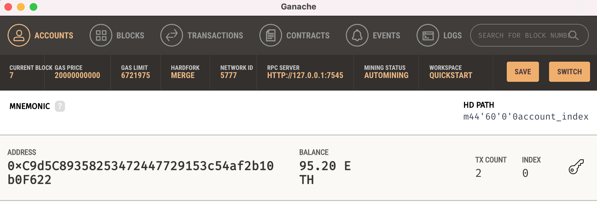
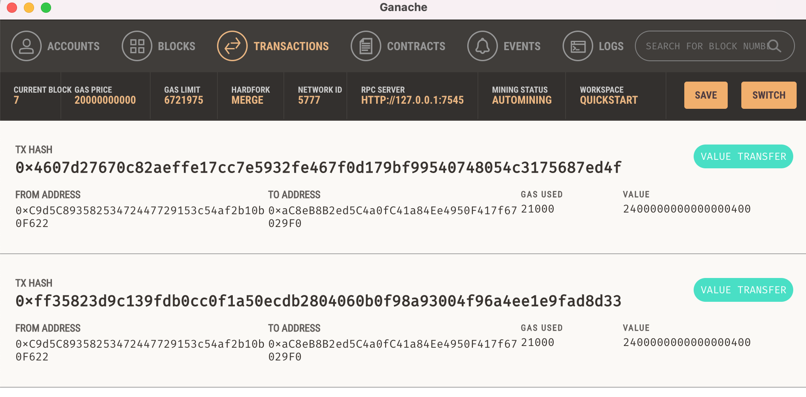
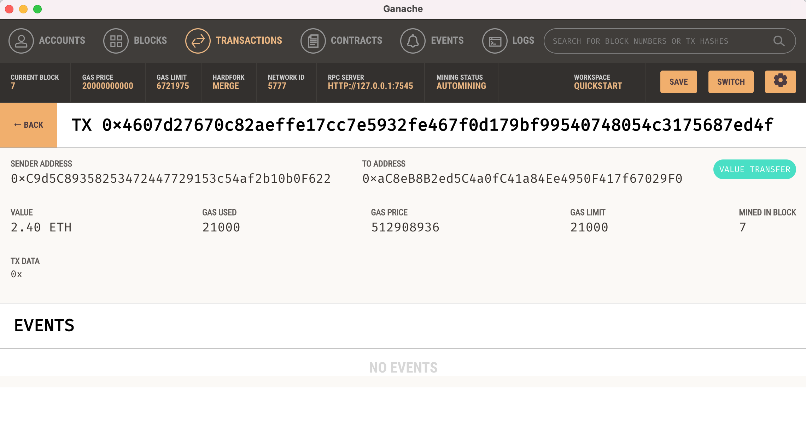
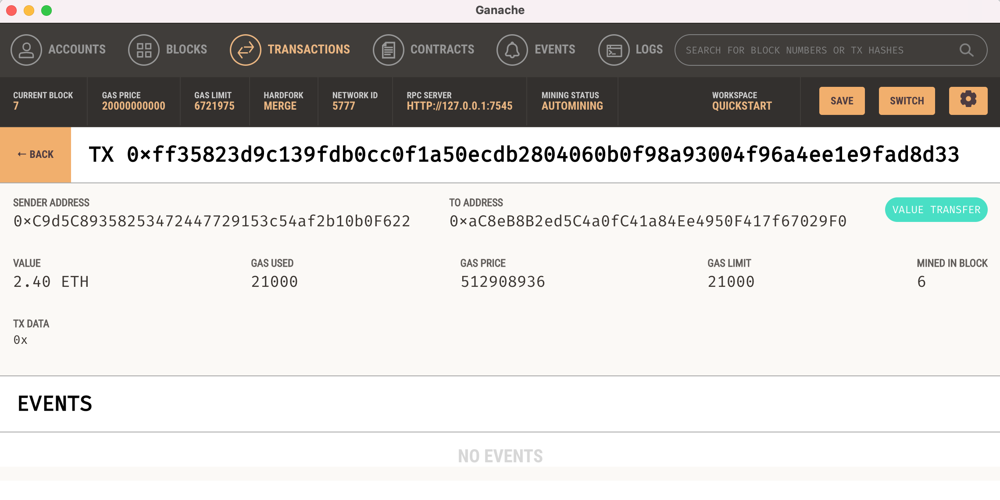

# Cryptocurrency_Transaction

This is a `.py` file to be opened in Visual Studio Code (VS Code). This file uses Ganache and Streamlit to perform Ethereum transactions and record them. This file gathers sender, receiver, and hourly-rate information to perform Ethereum transactions and records them in the block using hashing.

---

## Technologies

This application was written in Python 3.9.12. This application is dependent on the following libraries:

* [streamlit](https://streamlit.io/)
* [dataclasses](https://docs.python.org/3/library/dataclasses.html)
* [typing](https://docs.python.org/3/library/typing.html)
* [web3](https://web3py.readthedocs.io/en/v5/)
* [mnemonic](https://pypi.org/project/mnemonic/)
* [os](https://docs.python.org/3/library/os.html)
* [requests](https://pypi.org/project/requests/)
* [dotenv](https://pypi.org/project/python-dotenv/)
* [bip44](https://pypi.org/project/bip44/)

---

## Installation Guide

Install [VS Code](https://code.visualstudio.com/) if you don't already have it.

Install [Ganache](https://trufflesuite.com/ganache/) if you don't already have it.

If you have [Anaconda](https://www.anaconda.com/products/distribution) downloaded, then dataclasses and typing will be part of your package. You can check that they're ready to use by typing the following in your CLI terminal:

```python
conda list dataclasses
conda list typing
```

If you need to install streamlit:

```python
pip install streamlit
pip install web3==5.17
pip install mnemonic
pip install os-sys
pip install requests
pip install python-dotenv
pip install bip44
```

then you can check that these were installed by entering:

```python
conda list streamlit
conda list web3==5.17
conda list mnemonic
conda list os-sys
conda list requests
conda list python-dotenv
conda list bip44
```

---

## Usage

Clone this repository to your local machine. Use your terminal (MacOS) or gitbash (Windows) to open the file. Open Ganache. Create your .env file in the repo folder with your person Ganache mnemonic.

Type `streamlit run fintech_finder.py` and hit ENTER.

Streamlit will then open the file in your default internet browser. You can view youe account number and balance. You can choose your employee, enter how many hours they've worked, it will populate their hourly rate, then you can click "send transaction" to send the money. You can view the transaction and your history in the Ganache desktop app.

See some sample screenshots below:







---

## Contributors

[Rachel Ann Hodson](https://www.linkedin.com/in/rachelannhodson/)
rachelannhodson@gmail.com

---

## License

MIT